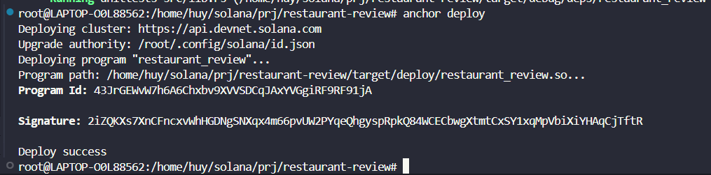
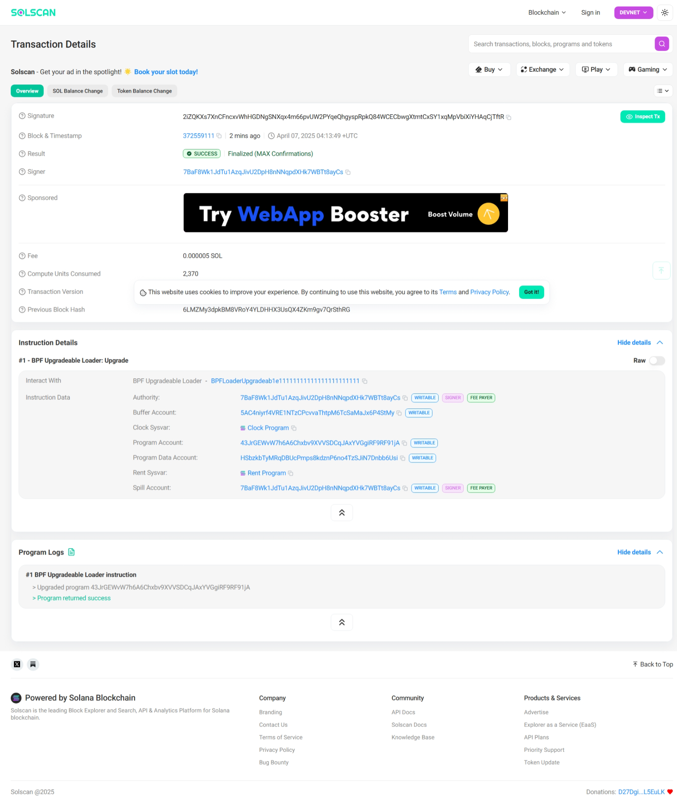
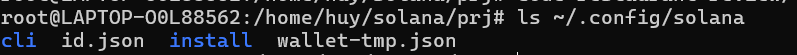
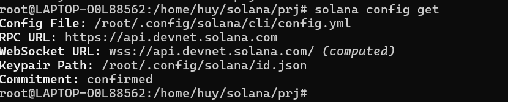

# Lesson 1: Setting Up the Development Environment 

## Kết quả 
Sau khi chạy deploy project, ta được kết quả : 

Tìm kiếm contract đã được deploy trên mạng Devnet trên Solana explorer : 

## Một số anchor CLI thông dụng 

`anchor init my-program`

Khởi tạo một project Anchor mới có tên `my-program`.

`anchor build`

Biên dịch chương trình Anchor (Rust → BPF bytecode).

- Output: `target/deploy/<program>.so` và `.json` IDL
- Kiểm tra lỗi compile, dependency,...

---

`anchor deploy`

Deploy contract lên cụm mạng hiện tại (localnet/devnet/testnet/mainnet).

- Sử dụng keypair tại `target/deploy/<program>-keypair.json`

📌 Yêu cầu: `solana config get` phải trỏ tới đúng network.

---

`anchor test`

Chạy toàn bộ test trong thư mục `tests/` bằng mocha + TypeScript.

- Tự động chạy `anchor build` trước
- Sử dụng `anchorProvider` để kết nối cluster
- Tương đương với `mocha tests/*.ts`

---

### 🔐 Quản lý khóa và program ID

`solana-keygen new -o ./target/deploy/your_program-keypair.json --force`

Tạo mới một keypair cho contract:

- `--force`: Ghi đè file nếu đã tồn tại
- Kết quả là file JSON chứa secret key
- Dùng làm `Program ID` cho Anchor (`declare_id!()`)

---

`solana program close <PROGRAM_ID> --bypass-warning`

Huỷ đăng ký và xoá chương trình khỏi mạng (chỉ khi bạn là người deploy).

- Hoàn lại SOL nếu còn thừa trong account chương trình
- ⚠️ Thao tác không thể đảo ngược
- ⚠️ Sau khi close program, phải sinh keypair mới cho contract nếu muốn deploy lại 

---

### 📁 Solana Keypair & Wallet

`ls ~/.config/solana`

Liệt kê các file lưu trữ ví và cấu hình Solana hiện tại.

- Thường chứa:
  - `id.json`: ví mặc định
  - `cli/config.yml`: thông tin cluster, ví mặc định
  - Các ví tạm, backup, keypair khác

Ví dụ : Có 2 ví `id.json` (wallet chính), `wallet.json` (1 wallet phụ)

---

`solana-keygen pubkey ~/.config/solana/id.json`

Hiển thị `public key` của ví tương ứng với file secret key JSON.

---

### 🧩 Các lệnh bổ sung hữu ích

`solana config get`

Hiển thị cấu hình hiện tại của CLI:

- Ví mặc định
- RPC URL
- WebSocket URL
- Output format

---

`solana config set --url https://api.devnet.solana.com`

Cấu hình Anchor/Solana CLI để sử dụng Devnet.

- Có thể thay bằng `--url localhost`, `testnet`, `mainnet-beta`

---

`solana airdrop 2`

Nhận 2 SOL cho ví mặc định (chỉ áp dụng trên localnet hoặc devnet).

---

`solana program show <PROGRAM_ID>`

Xem thông tin chương trình đã deploy: bytecode size, owner, lamports,...

---

## 📌 Ghi chú

- Tất cả các keypair (`.json`) đều chứa secret key → không nên public.

---
