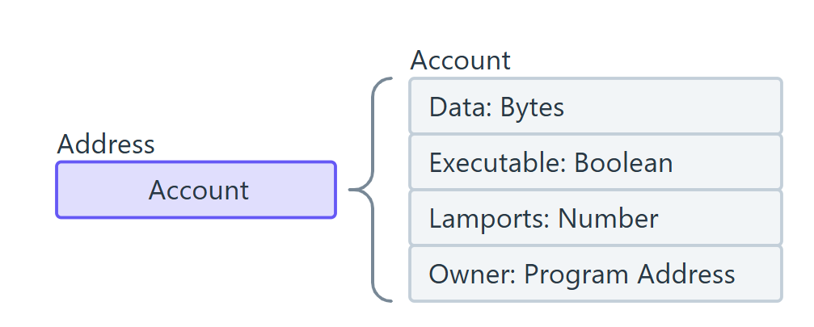

# **1. Solana architecture**

Solana có một mô hình thiết kế khác biệt so với các blockchain truyền thống như Ethereum.

---

## **1.1 Accounts**
Trong Solana, **tất cả dữ liệu lưu dưới dạng account**. Không giống Ethereum (phân biệt giữa Externally Owned Account và Smart Contract Account). \
Mỗi accout trong solana được xác định bởi 32 byte address/ public key.

### Account type

- Data 

    - Là một mảng byte lưu trữ dữ liệu tùy ý.  
    - Đối với non-executable accounts, dữ liệu này thường chỉ được đọc.  
    - Đối với executable accounts (smart contract), nó chứa mã thực thi của chương trình.

- executable : A boolean flag that indicates if the account is a program.

- lamports : The account's balance in lamports, the smallest unit of SOL (1 SOL = 1 billion lamports).  

- owner (Chủ sở hữu tài khoản) : The program ID (public key) of the program that owns this account. Only the owner program can modify the account's data or deduct its lamports balance.

- rent_epoch 

### Native Program 

### **Các loại account trong Solana**
- **Executable Accounts**: Chứa **programs** (smart contracts). Một khi đã triển khai, chúng không thể bị sửa đổi.
- **Data Accounts (Storage Accounts)**: Lưu trữ dữ liệu (giống contract storage trên Ethereum). Mỗi account cần một lượng SOL để duy trì.
- **System Accounts**: Các account đặc biệt do hệ thống quản lý, như **SYSVAR accounts** để theo dõi trạng thái blockchain.

📌 **Lưu ý quan trọng:**
- Mỗi account cần một lượng **lamports** (đơn vị của SOL) tối thiểu để tồn tại.
- Dữ liệu của account bị giới hạn ở **4096 bytes**, nếu lớn hơn thì cần sử dụng **PDA (Program Derived Address)**.

---

## **1.2 Transactions**

### **Cấu trúc giao dịch**
Mỗi giao dịch trong Solana bao gồm:
- **Signers**: Các tài khoản cần ký giao dịch.
- **Instructions**: Danh sách các hành động cần thực hiện (mỗi instruction là một lời gọi đến một program cụ thể).
- **Recent Blockhash**: Một hash của block gần nhất để ngăn chặn replay attack.

### **Đặc điểm giao dịch trong Solana**
✅ **Nhiều instructions trong một giao dịch**: Một transaction có thể chứa nhiều instructions (gọi nhiều smart contracts cùng lúc).

✅ **Parallel Execution (Chạy song song)**: Solana sử dụng **Sealevel** để cho phép các transactions không phụ thuộc chạy song song, giúp tăng throughput.

✅ **Atomic Transactions (Giao dịch nguyên tử)**: Nếu một instruction trong transaction thất bại, toàn bộ transaction sẽ rollback.

---

## **3. Programs (Smart Contract trong Solana)**

Trong Solana, **smart contracts** được gọi là **Programs** và được viết bằng **Rust, C hoặc C++**, thường sử dụng **Anchor framework** để đơn giản hóa quá trình phát triển.

### **Đặc điểm của Programs**
- **Không có trạng thái (stateless)**: Programs không thể tự lưu trữ dữ liệu bên trong chúng, thay vào đó dữ liệu được lưu trong **Accounts**.
- **Bất biến (Immutable)**: Một khi đã triển khai, program không thể bị thay đổi (trừ khi có cơ chế upgradable program).
- **Xử lý bằng BPF (Berkeley Packet Filter)**: Solana sử dụng BPF để thực thi smart contract với hiệu suất cao hơn EVM.

### **Cách hoạt động của Programs**
1. **Users gửi transactions** chứa instructions.
2. **Solana VM (Sealevel)** xử lý transactions và gửi instructions đến các programs.
3. **Programs xử lý logic** và đọc/ghi dữ liệu vào các accounts liên quan.

---

## **Tóm tắt kiến trúc Solana**

| Thành phần    | Chức năng |
|--------------|----------|
| **Accounts** | Lưu trữ dữ liệu, trạng thái của smart contracts. |
| **Transactions** | Gửi dữ liệu/instructions đến blockchain, có thể chứa nhiều instructions. |
| **Programs** | Smart contracts, xử lý logic nhưng không lưu trữ dữ liệu bên trong. |

Bạn đang muốn đào sâu phần nào? 🚀
