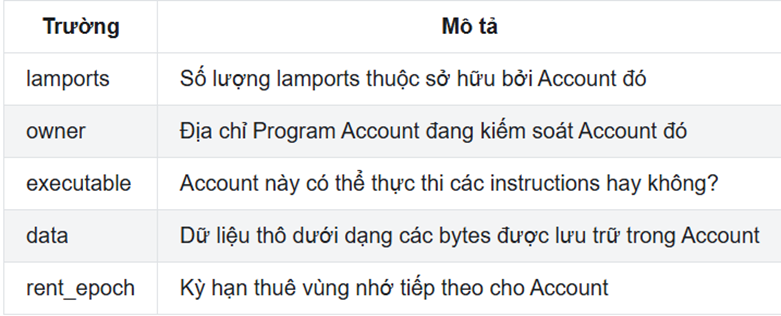
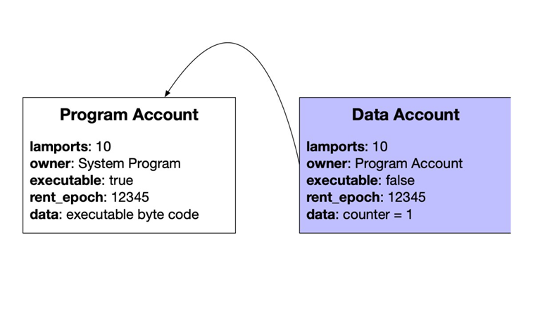
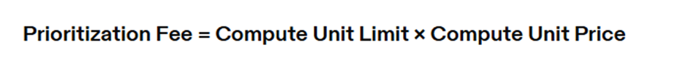
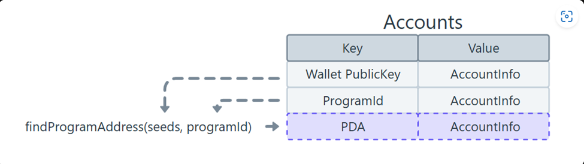
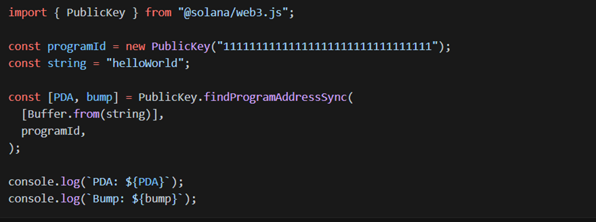

# 📘 Lesson 2: Understanding Solana and Anchor Basics

## 1. Accounts on Solana

Solana có 3 loại account chính:

### 📂 Data Accounts
- Dùng để **lưu trữ dữ liệu** (trạng thái người dùng, điểm số, config,...)
- Có 2 dạng:
  - **System-owned**: do `System Program` sở hữu (VD : ví người dùng).
  - **PDA (Program Derived Address)**: dùng làm storage cho smart contract.

### 💻 Program Accounts
- Lưu trữ **bytecode của chương trình** (smart contract).
- Được triển khai (deploy) bởi `BPF Loader`.
- Có thể **cập nhật** nếu còn `upgrade authority`.

### 🧩 Native Program Accounts
- Là **native program** có sẵn trên Solana, ví dụ :
  - `System Program`: `11111111111111111111111111111111`
  - `Stake Program`: `Stake11111111111111111111111111111111111111`
  - `Vote Program`: `Vote111111111111111111111111111111111111111`
- Là core system → **không thể bị xóa**.

---

### Các trường trong account 

### 🔐 Một số quy tắc với account:
- **Chỉ chủ sở hữu (`owner`)** mới có quyền ghi dữ liệu hoặc rút lamports từ account.
- **Bất kỳ ai** cũng có thể **gửi SOL vào** account.
- Một account có thể **chuyển `owner`**.

### ⚠️ Program không lưu state:
- Vì bản chất program là **stateless**, nên cần ít nhất **2 account** để lưu và thay đổi state (1 để chứa dữ liệu, 1 để làm authority).

VD : 1 counter program cần 2 account (Program Account để lưu bytecode và Data Account để lưu dữ liệu)

---

## 2. Transactions & Instructions

- **Transaction** là gói dữ liệu bao gồm một hoặc nhiều **instruction**.
- Khi một transaction được gửi lên, **Solana Runtime** sẽ xử lý tuần tự từng instruction.
- Transaction mang tính **atomic** (tất cả thành công hoặc tất cả fail).
- Kích thước tối đa một transaction là **1232 bytes**.

### 📦 Một Instruction gồm:
- `Program ID`: địa chỉ của chương trình xử lý instruction.
- `Accounts`: danh sách các account được sử dụng.
- `Data`: dữ liệu đầu vào cho instruction.

🪙 **Ví dụ phổ biến**: Gửi SOL (native transfer) là một instruction.

---

## 3. Transaction Fees

### 💰 Base Fee
- **5000 lamports per signature**
- Được trả bởi người đầu tiên ký (fee payer)
- **50% bị đốt**, **50% trả cho validator**

### 🚀 Prioritization Fee (optional)
- Gợi ý ưu tiên xử lý giao dịch.
- Theo **SIMD-0096**: 100% fee này được trả cho validator xử lý transaction.

---

## 4. Programs

### 💡 Key facts:
- Trên Solana, **smart contract** được gọi là **program**.
- User tương tác với programs bằng cách gửi các transaction chứa instruction chỉ ra programs phải làm gì. 
- Program là account có flag `executable = true`.
- Chạy bởi `BPF Loader` → tương thích BPF bytecode.
- **Mutable by default 😱**, trừ khi set owner về `0x00`.

### 🛠 Viết program:
- **Rust Native**
- **Anchor Framework** (được khuyên dùng)
- Có thể dùng C++ nhưng không phổ biến

---

## 5. PDA (Program Derived Address)

### ✨ PDA là gì?
- Là **địa chỉ on-chain được tính toán xác định** bằng seed + bump + Program ID.
- Không nằm trên curve Ed25519 → **không có private key**.
- Dùng để:
  - Làm storage (`Account` định danh)
  - Làm authority có thể **kí giao dịch** thông qua `signer seeds`

---

### 🔧 Key Point về PDA:
- PDA chỉ là public key, không tự động tạo ra tài khoản on-chain khi tính toán.
- Tài khoản sử dụng PDA làm địa chỉ phải được tạo rõ ràng thông qua một instruction chuyên biệt trong chương trình Solana.
- Dùng trong `#[account(seeds = [...], bump)]` để xác thực PDA đúng.

---
### Find PDA example code ts 

---

## 📚 References

- [Solana Docs PDA](https://solana.com/vi/developers/courses/program-security/account-data-matching)
- [QuickNode](https://www.quicknode.com/guides/solana-development/anchor/system-program-pda)
- [Solana Cookbook](https://solanacookbook.com/)

---
