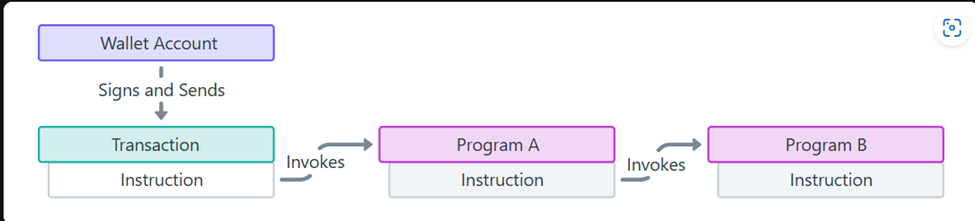
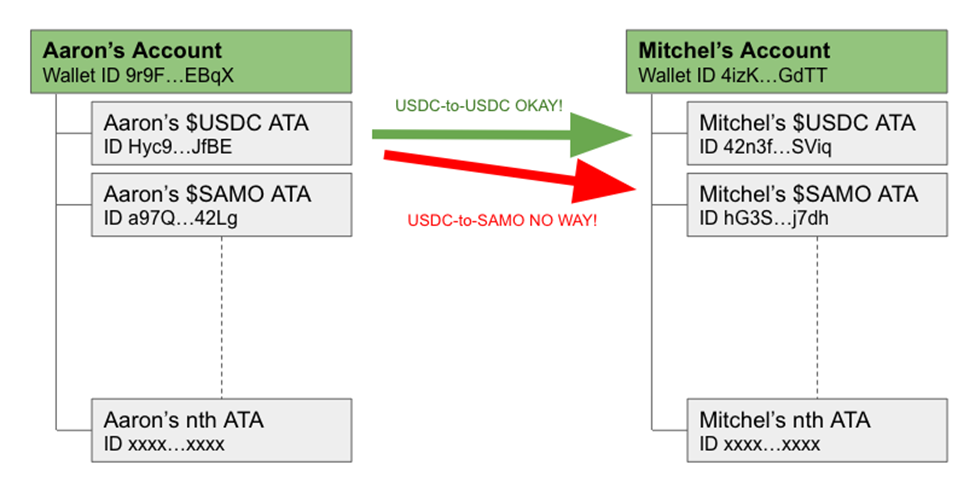
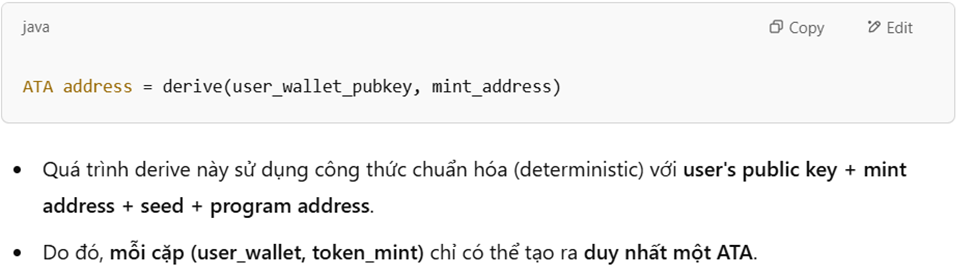

# Lesson 5: Cross-Program Invocation (CPI)

---

## 🔁 CPI 

CPI (Cross-Program Invocation) là khi **một chương trình (Program A)** gọi đến một **hàm (instruction)** của **chương trình khác (Program B)**.

> ✨ Có thể tưởng tượng CPI giống như gọi một **API** từ một service khác.


### 🧩 Mục đích:
- Tăng khả năng **composability** giữa các chương trình
- Cho phép **tái sử dụng logic** đã được viết sẵn (ví dụ: `Token Program`, `Associated Token Program`,...)

---

### ⚠️ Chú ý : 

- **Depth tối đa**: 4 cấp gọi lồng nhau
- **Chỉ chương trình tạo ra PDA từ `program_id` của chính nó mới được quyền ký bằng PDA**
- Dữ liệu truyền qua CPI phải phù hợp với chương trình đích (check bằng IDL nếu có)

---

### ✌️ Hai loại CPI

| Loại                | Dùng khi nào                                    |
|---------------------|--------------------------------------------------|
| `invoke`            | Gọi chương trình khác mà **không cần PDA ký**    |
| `invoke_signed`     | Gọi chương trình khác mà **có PDA ký giao dịch** |

---

### ✅ invoke example 

```rust
use solana_program::program::invoke;
use solana_program::system_instruction;

let ix = system_instruction::transfer(
    &from.key(),
    &to.key(),
    lamports,
);

invoke(
    &ix,
    &[
        from.to_account_info(),
        to.to_account_info(),
        system_program.to_account_info(),
    ],
)?;
``` 

## 🪙 SPL Token trên Solana

### Các thành phần chính

| Thành phần             | Mô tả |
|------------------------|------|
| Mint                   | Địa chỉ SPL token được tạo ra, đại diện cho SPL Token đó|
| Token Account          | Lưu token |
| ATA                    | Tài khoản được tạo ra để hold token, mỗi account chỉ tạo được 1 ATA duy nhất cho 1 SPL token  |





### Token Program

Program ID: TokenkegQfeZyiNwAJbNbGKPFXCWuBvf9Ss623VQ5DA

### Dùng trong Anchor

```toml
idl-build = [
    "anchor-lang/idl-build",
    "anchor-spl/idl-build",
]

...

[dependencies]
anchor-spl = "0.29.0"
```

```rust
use anchor_spl::token::{Token, Mint, TokenAccount, Transfer, transfer};
```

### Example transfer

```rust
let cpi_accounts = Transfer {
    from: from_token.to_account_info(),
    to: to_token.to_account_info(),
    authority: authority.to_account_info(),
};

let cpi_ctx = CpiContext::new(token_program.to_account_info(), cpi_accounts);
transfer(cpi_ctx, amount)?;
```

### CLI hỗ trợ

```bash
spl-token create-token
spl-token create-account <TOKEN_MINT>
spl-token mint <TOKEN_MINT> 100
spl-token balance <TOKEN_MINT>
```

Tìm hiểu nhiều CLI hơn tại : [SPL Token CLI](https://spl.solana.com/token)

## 📚 References

- [Solana Docs CPI](https://solana.com/vi/docs/core/cpi)
- [QuickNode CPI](https://www.quicknode.com/guides/solana-development/anchor/what-are-cpis)
- [QuickNode SPL Token](https://www.quicknode.com/guides/solana-development/anchor/transfer-tokens)
- [Solana Cookbook](https://solanacookbook.com/)

---